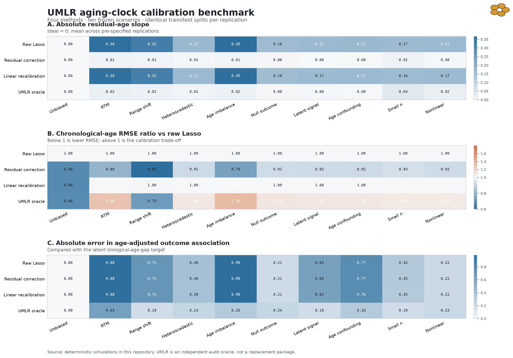

# UMLR aging-clock validation

Independent, reproducible validation of the official **unbiased machine-learning
regression (UMLR)** method for aging clocks.

## Bottom line

The updated prior-art gate found an official implementation at
[`hwiyoungstat/UMLR`](https://github.com/hwiyoungstat/UMLR). Therefore this
repository is **not a second production implementation**. It is an audit harness
that:

- checks the authors' two-region calibration equations with an independent
  numerical oracle;
- compares raw Lasso, residual correction, linear recalibration and UMLR on ten
  frozen simulation scenarios;
- keeps calibration fitting separate from untouched test data;
- tests failure modes, including range shift, small samples and nonlinear bias;
- runs one aggregate-only real-data demonstration when the external input passes
  the licensing and access checks;
- supplies upstream-facing tests without vendoring the unlicensed UMLR source.

The official method changes the **training objective of the aging clock**. It is
not a post-hoc function that can safely be fit to chronological age and already
predicted age. No `OutcomeCalibrator.fit(age, prediction, outcome)` API is exposed
here because that would misrepresent the papers.

## Gate status

| Gate | Status | Evidence |
|---|---|---|
| A - novelty | GO as audit/gap project | Official code exists, but has no license, package metadata, tests, CI or release; see [`prior-art.md`](prior-art.md). |
| B - mathematics | GO | 26 tests verify the equations, known simulation behavior, leakage boundary and edge cases; 30 replications of all ten frozen scenarios completed. |
| C - usefulness | CONDITIONAL | UMLR reduced residual-age slope, but increased RMSE in 8/10 scenarios and was worst on the small open-data holdout. Use only after an explicit trade-off analysis; see [`results/summary.md`](results/summary.md). |

## Key result

UMLR is effective at its narrow mathematical target: it reduced the absolute
residual-age slope in every biased simulation. This was not a free improvement.
Compared with raw Lasso, mean RMSE rose by 30% under regression-to-the-mean and
35% under age imbalance, and was higher in eight of ten scenarios. On the
pre-specified OmniAge holdout, UMLR MAE was 12.1 years versus 10.2 for raw Lasso
and 7.1 for residual correction. The cohort is small, so this is falsification
evidence rather than a definitive performance ranking.



## Reproduce

Python 3.11 or newer is required.

```bash
python3 -m venv .venv
.venv/bin/python -m pip install -e '.[dev]'
.venv/bin/python -m pytest
.venv/bin/ruff check .
.venv/bin/aging-clock-audit benchmark
.venv/bin/python scripts/build_tradeoff_table.py
```

The benchmark writes:

- `results/tables/simulation_replications.csv`
- `results/tables/simulation_summary.csv`
- `results/figures/simulation-benchmark.png`

The real-data example is deliberately separate. It fetches a checksum-pinned
external input into ignored `data/raw/`, then writes aggregate outputs only:

```bash
.venv/bin/python scripts/fetch_external_data.py
.venv/bin/python examples/run_omniage_example.py
```

See [`data/manifest.json`](data/manifest.json) for provenance and redistribution
rules. To reproduce the exact tested environment, install
`requirements-lock.txt` before the editable package.

## Leakage-safe API

```python
from aging_clock_audit.models import ConstrainedLassoOracle
from aging_clock_audit.metrics import diagnostic_metrics

model = ConstrainedLassoOracle(lambda_=0.02).fit(train_X, train_age)
test_prediction = model.predict(test_X)  # predict never refits
report = diagnostic_metrics(test_age, test_prediction, outcome=test_outcome)
metadata = model.metadata_  # fit size, age range, constraint error, fingerprint
```

The input is the biomarker matrix, not an already fitted clock prediction. A
post-hoc `OutcomeCalibrator` would misstate the authors' method.

## Repository map

```text
src/aging_clock_audit/   independent metrics, oracle and CLI
tests/                   equation, leakage and edge-case tests
simulations/             benchmark entry point
examples/                real-data demonstration
notebooks/               executed reader-facing analysis
data/                    manifest plus ignored external inputs
results/tables/          reviewed aggregate results
results/figures/         reviewed static figures
outreach/                author message and upstream issue drafts
```

The executed reader-facing analysis is
[`notebooks/benchmark.ipynb`](notebooks/benchmark.ipynb).

## Scope and interpretation

- `ConstrainedLassoOracle` is a validation oracle, not a supported clinical or
  research package.
- Lower chronological-age error does not prove a better biological-age measure.
- A flat residual-age slope does not by itself prove biological validity.
- No clinical claims are made.
- The raw UK Biobank and Framingham data used by the authors are controlled
  access and are not used or redistributed here.

## Licensing

Code written in this repository is MIT licensed. The official UMLR repository did
not contain a license at the audited commit, so its source is not copied here.
External data and third-party materials retain their original terms and are not
redistributed.

## Citation

See [`CITATION.cff`](CITATION.cff). This repository is an independent audit and
does not claim authorship of UMLR.
